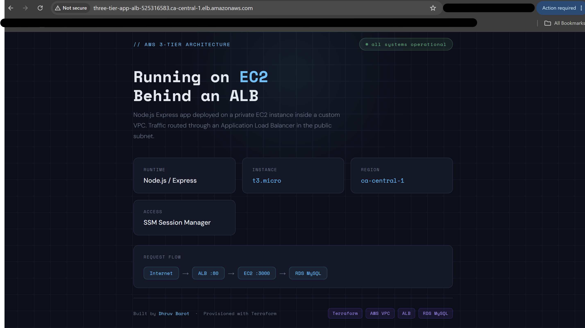

# Three-Tier AWS Architecture with Terraform


A production-style 3-tier AWS architecture fully provisioned using modular Terraform. The infrastructure separates concerns across a web tier (ALB), application tier (EC2), and database tier (RDS MySQL) — all deployed inside a custom VPC with public and private subnets across two availability zones in `ca-central-1`.

---

## Architecture Overview

```
                          Internet
                              │
                         [ALB :80]
                    (Public Subnet - 2 AZs)
                              │
                     [EC2 - Node.js :3000]
                   (Private Subnet - 2 AZs)
                    SSM Session Manager Access
                              │
                      [RDS MySQL :3306]
                   (Private Subnet - 2 AZs)
                       No Public Access
```

### Network Layout

```
VPC: 10.0.0.0/16
├── Public Subnet 1   10.0.1.0/24   ca-central-1a   → ALB, NAT Gateway
├── Public Subnet 2   10.0.2.0/24   ca-central-1b   → ALB
├── Private Subnet 1  10.0.3.0/24   ca-central-1a   → EC2, RDS
└── Private Subnet 2  10.0.4.0/24   ca-central-1b   → EC2, RDS
```

---

## Tech Stack

| Layer       | Service              | Details                          |
|-------------|----------------------|----------------------------------|
| Network     | AWS VPC              | Custom VPC, subnets, IGW, NAT GW |
| Web Tier    | AWS ALB              | External, HTTP:80, 2 AZs         |
| App Tier    | AWS EC2              | t2.micro, Amazon Linux 2023      |
| Runtime     | Node.js / Express    | Port 3000, deployed via user_data|
| Database    | AWS RDS MySQL        | db.t3.micro, single-AZ, private  |
| Access      | AWS SSM              | Session Manager, no SSH          |
| IaC         | Terraform            | Modular structure, v5 provider   |

---

## Project Structure

```
three-tier-architecture-aws/
├── modules/
│   ├── vpc/
│   │   ├── main.tf          # VPC, subnets, IGW, NAT GW, route tables
│   │   ├── variables.tf
│   │   └── outputs.tf
│   ├── alb/
│   │   ├── main.tf          # Security group, ALB, target group, listener
│   │   ├── variables.tf
│   │   └── outputs.tf
│   ├── ├── ec2/
│   │   ├── scripts/
│   │   │   └── user_data.sh # Bootstrap script — installs Node.js, starts Express app
│   │   ├── main.tf          # Security group, IAM role, EC2 instance, TG attachment
│   │   ├── variables.tf
│   │   └── outputs.tf
│   └── rds/
│       ├── main.tf          # Security group, subnet group, RDS instance
│       ├── variables.tf
│       └── outputs.tf
├── main.tf                  # Root module — wires all modules together
├── variables.tf             # Input variable declarations
├── outputs.tf               # ALB DNS name, VPC ID, RDS endpoint
├── providers.tf             # AWS provider configuration
├── versions.tf              # Terraform and provider version constraints
├── terraform.tfvars         # Variable values (gitignored)
├── terraform.tfvars.example # Template for required variables
└── .gitignore
```

---

## Security Design

Each tier only accepts traffic from the tier directly above it — enforced through security group rules using `referenced_security_group_id`:

```
Internet   → ALB  (port 80,   source: 0.0.0.0/0)
ALB        → EC2  (port 3000, source: ALB security group)
EC2        → RDS  (port 3306, source: EC2 security group)
```

- EC2 has no public IP and is not reachable from the internet directly
- RDS has no public access and only accepts connections from EC2
- EC2 accessed exclusively via AWS SSM Session Manager — no SSH, no bastion host
- NAT Gateway enables outbound-only internet access from private subnets

---

## Prerequisites

- [Terraform](https://developer.hashicorp.com/terraform/install) >= 1.0.0
- [AWS CLI](https://aws.amazon.com/cli/) configured with appropriate credentials
- AWS account with permissions for VPC, EC2, RDS, IAM, and ELB

---

## Deployment

**1. Clone the repository**
```bash
git clone https://github.com/dhruvs-git/three-tier-architecture-aws.git
cd three-tier-architecture-aws
```

**2. Create your `terraform.tfvars` file**
```hcl
project_name         = "three-tier-app"
aws_region           = "ca-central-1"
cidr_block           = "10.0.0.0/16"
public_subnet_cidrs  = ["10.0.1.0/24", "10.0.2.0/24"]
private_subnet_cidrs = ["10.0.3.0/24", "10.0.4.0/24"]
availability_zones   = ["ca-central-1a", "ca-central-1b"]
db_name              = "appdb"
db_username          = "admin"
db_password          = "YourSecurePassword123!"
```

**3. Initialize Terraform**
```bash
terraform init
```

**4. Preview the infrastructure plan**
```bash
terraform plan
```

**5. Deploy**
```bash
terraform apply
```

Deployment takes approximately 10-15 minutes. RDS provisioning is the longest step.

**6. Access the application**

After apply completes, Terraform outputs the ALB DNS name:
```
Outputs:
alb_dns_name = "three-tier-app-alb-xxxxxx.ca-central-1.elb.amazonaws.com"
```

Open that URL in your browser to confirm the application is running.

**7. Destroy when done**
```bash
terraform destroy
```

> NAT Gateway and RDS incur hourly charges. Always destroy after testing.

---

## Module Breakdown

### VPC Module
Provisions the entire network layer — VPC, public and private subnets across 2 AZs, Internet Gateway for public traffic, NAT Gateway for private subnet outbound access, and route tables for both tiers.

### ALB Module
Provisions the external Application Load Balancer in public subnets. Includes a security group, target group pointing to EC2 port 3000, and an HTTP listener on port 80 that forwards traffic to the target group.

### EC2 Module
Provisions the application server in a private subnet. Includes an IAM role with `AmazonSSMManagedInstanceCore` for SSM access, an instance profile, the EC2 instance running Amazon Linux 2023, and target group registration. The Node.js/Express app is bootstrapped via user_data on first boot.

### RDS Module
Provisions the MySQL database in private subnets. Includes a DB subnet group across both private subnets, a security group allowing port 3306 only from EC2, and a single-AZ RDS instance with no public access.

---



## Author

**Dhruv Barot**
[GitHub](https://github.com/dhruvs-git) · [LinkedIn](https://www.linkedin.com/in/dhruv-barot-bb71a3268/)